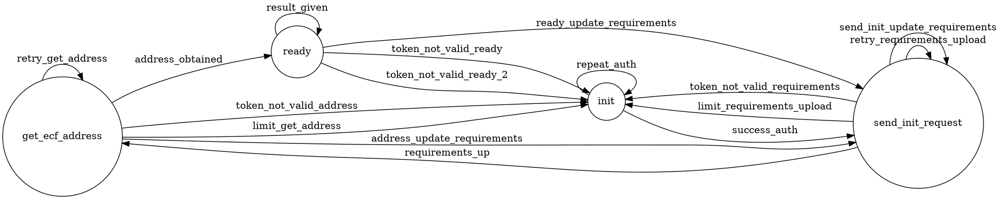

# State Machine Summary

## States

- get_ecf_address (initial: False)

- init (initial: True)

- ready (initial: False)

- send_init_request (initial: False)

## Transitions

| Source State      | Target State      | Event                         |
| ----------------- | ----------------- | ----------------------------- |
| get_ecf_address   | ready             | address_obtained              |
| get_ecf_address   | init              | token_not_valid_address       |
| get_ecf_address   | get_ecf_address   | retry_get_address             |
| get_ecf_address   | init              | limit_get_address             |
| get_ecf_address   | send_init_request | address_update_requirements   |
| init              | send_init_request | success_auth                  |
| init              | init              | repeat_auth                   |
| ready             | ready             | result_given                  |
| ready             | init              | token_not_valid_ready         |
| ready             | init              | token_not_valid_ready_2       |
| ready             | send_init_request | ready_update_requirements     |
| send_init_request | get_ecf_address   | requirements_up               |
| send_init_request | init              | token_not_valid_requirements  |
| send_init_request | send_init_request | retry_requirements_upload     |
| send_init_request | init              | limit_requirements_upload     |
| send_init_request | send_init_request | send_init_update_requirements |

## Chart overview

## State Diagrams
### Simple State Diagram

### Detailed State Diagram

